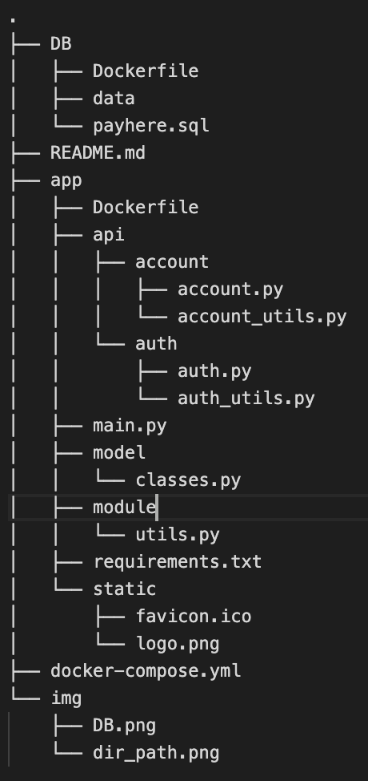

## 소비내역 기록/관리 웹 프로젝트
---
### Description
- 사용스택 : FastAPI, Docker, MySQL
- 설명 : 소비내역을 기록하기 위한 전체 프로젝트 중 DB, REST API 부분을 구현하였습니다.
- 확장이 쉽도록 dir를 설계하였으며, 1번이상 재사용되는 함수와 클래스는 사용하기 쉽도록 모아서 작성되었습니다.

---
### Environment
- 어느 환경에서나 구동이 가능하도록 Container 기반으로 제작되었으며, Image 역시 docker-compose를 통하여 빌드됩니다.
- DB schema 파일 및 SQL 구문이 저장되어있습니다.
---
### dir, DB 구조

|server|DB|
|---|:---:|
|  |  |

---

### Server(FastAPI)  
#### 파일 설명
- Dockerfile -> 컨테이너 이미지 파일
- main.py -> 초기 진입점, 주기적 DB 삭제
- requirements.txt -> 컨테이너 이미지에 필요한 pip list  

- <strong>api 관련</strong>
>- account -> 가계부 관련 api 및 utils
>- auth -> 인증 관련 api 및 utils  

- <strong>기타</strong>
>- model - classes.py -> class 선언 파일
>- module - utils.py -> 공통적으로 사용되는 함수
>- static -> 정적파일

#### 설계
> - 새로운 service가 생성된다면 main에 router를 추가하고 api dir에 추가되는 방식으로 확장성이 용이하도록 제작되었습니다.
> - 1번이상 재사용된 함수들은 utils.py에, service 고유의 함수들은 각 dir의 service_utils.py에 담겨있습니다.
> - pydantic의 validator를 통하여 프론트에서 넘어오는 feature의 type을 검사합니다.
> - JWT토큰을 사용하여 refresh, access 토큰을 구현하였으며, 회원가입 및 로그인을 제외한 모든 api에 토큰을 사용하게 됩니다.
> - 로그아웃은 프론트에서 처리하는 것을 염두하고 세션 아이디는 따로 구현하지 않았습니다.
> - FastAPI의 Swagger를 통하여 간단한 테스트를 사용할 수 있습니다.
> - 단축 URL의 특정시간 만료는 DB보다 서버에서 스케쥴링 하는 것이 낫다고 판단하여 APScheduler를 사용하여 5분마다 확인 후 삭제됩니다.
> - docker network를 사용하여 DB와 통신합니다.

---
### DB(MySQL)

#### 테이블쿼리
> - 테이블별로 auto_increment를 사용하여 primary key를 사용하였습니다.
> - user(email_index) <-> account(eamil_index) / account(account_index) <-> url(account_index) 로 foreign로 연결되어 있습니다.
> - url의 int type은 추후 상태 가능성을 고려하여 bool이 아닌 int로 타입을 지정하였습니다.
> - 비밀번호는 암호화되어 저장됩니다.
---

### 요구사항
- 고객은 이메일과 비밀번호 입력을 통하여 회원 가입을 할 수 있습니다. (O)
- 고객은 회원 가입 이후, 로그인과 로그아웃을 할 수 있습니다. (O)
- 고객은 로그인 이후 가계부 관련 아래의 행동을 할 수 있습니다. (O)
> 1. 가계부에 오늘 사용한 돈의 금액과 관련된 메모를 남길 수 있습니다. (O) 
> 2. 가계부에서 수정을 원하는 내역은 금액과 메모를 수정 할 수 있습니다. (O)
> 3. 가계부에서 삭제를 원하는 내역은 삭제 할 수 있습니다. (O)
> 4. 가계부에서 이제까지 기록한 가계부 리스트를 볼 수 있습니다. (O) 
> 5. 가계부에서 상세한 세부 내역을 볼 수 있습니다. (O) 
> 6. 가계부의 세부 내역을 복제할 수 있습니다. (O)
> 7. 가계부의 특정 세부 내역을 공유할 수 있게 단축 URL을 만들 수 있습니다. (O)
> - (단축 URL은 특정 시간 뒤에 만료되어야 합니다.) (O)
> 로그인하지 않은 고객은 가계부 내역에 대한 접근 제한 처리가 되어야 합니다. (O)
