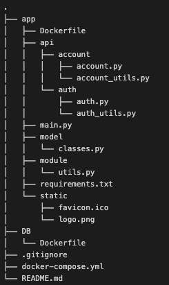

## dir 구조


## Server(FastAPI)


## DB(MySQL)
### 테이블
```SQL
create table user (email_index int not null auto_increment, email varchar(256) not null, password(100) varchar not null, primary key(email_index), unique(email));
```

```SQL
create table account (account_index int not null auto_increment, email_index int not null, create_time datetime not null, last_update_time datetime not null, money int not null, note varchar(256), type varchar(32), url varchar(8), create_time_url datetime, primary key(account_index), foreign key(email_index) references user (email_index) on delete cascade);
```

```SQL
create table url (account_index int not null, url varchar(8), create_time_url datetime, foreign key(account_index) references account (account_index) on delete cascade);
```